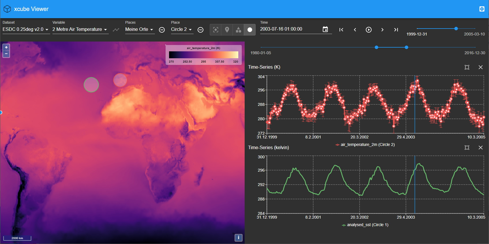

# xcube-viewer

A simple viewer component for Xcube server.

## Run it

1. Install [xcube](https://github.com/dcs4cop/xcube) and run server in demo mode
2. Install and start `xcube-viewer` with demo configuration

`xcube` one-time install:

    $ git clone https://github.com/dcs4cop/xcube.git
    $ cd xcube
    $ conda env create
    $ conda activate xcube
    $ python setup.py develop  

    
`xcube` update and run server:

    $ cd xcube
    $ git pull
    $ conda activate xcube  
    $ xcube serve --verbose --traceperf --config xcube/webapi/res/demo/config.yml  
    
If errors occur, you may need to update the environment:

    $ conda env update

Checkout `xcube-viewer` sources:

    $ git clone https://github.com/dcs4cop/xcube-viewer.git

`xcube-viewer` update, install, and run:

    $ cd xcube-viewer
    $ git pull
    $ yarn run start

If errors occur, you may need to update the environment:

    $ yarn install

Build `xcube-viewer` for deployment:

    $ cd xcube-viewer
    $ git pull
    $ yarn build

Find outputs in `./build`.

## Features

* Select dataset, update variable and places list, fly to bounding box
* Select place (Lakes / Stations) and fly to bounding box
* Select variable and show as layer on map
* Select time and update variable layer on map
* Click in map and show time series chart
* Select a place and show time series chart
* Select dataset and fly to bounding box
* Select place and fly to bounding box
* Click in time series chart and select time
* Show selected time in time series chart
* Zoom into and out of time series chart
* Use local time in UI (backend provides UTC time only)
* Show a variable's legend in map
* Switch language. Texts are internationalizable. Locales are currently "en" and "de". (see constant `I18N` in `src/config/config.ts`)
* Show modal "loading" dialog on initial data load
* Show toast on info events (e.g. server error) 
* Animate through time (play forw/back)
* Added means to select a time slice
* Time ranges set from datasets
* Change xcube server. Users' xcube server configurations are saved in local browser storage.  
* Place groups associated to datasets
  - produce a unique vector layer in the map;
  - can specify their feature property fields that will provide the values for predefined roles:
    "label", "infoUrl" (not used yet);

## More

* [User Guide](https://xcube.readthedocs.io/en/latest/viewer.html#)
* [Planned Enhancements](https://github.com/dcs4cop/xcube-viewer/labels/enhancement)
* [Known Issues](https://github.com/dcs4cop/xcube-viewer/labels/bug)

